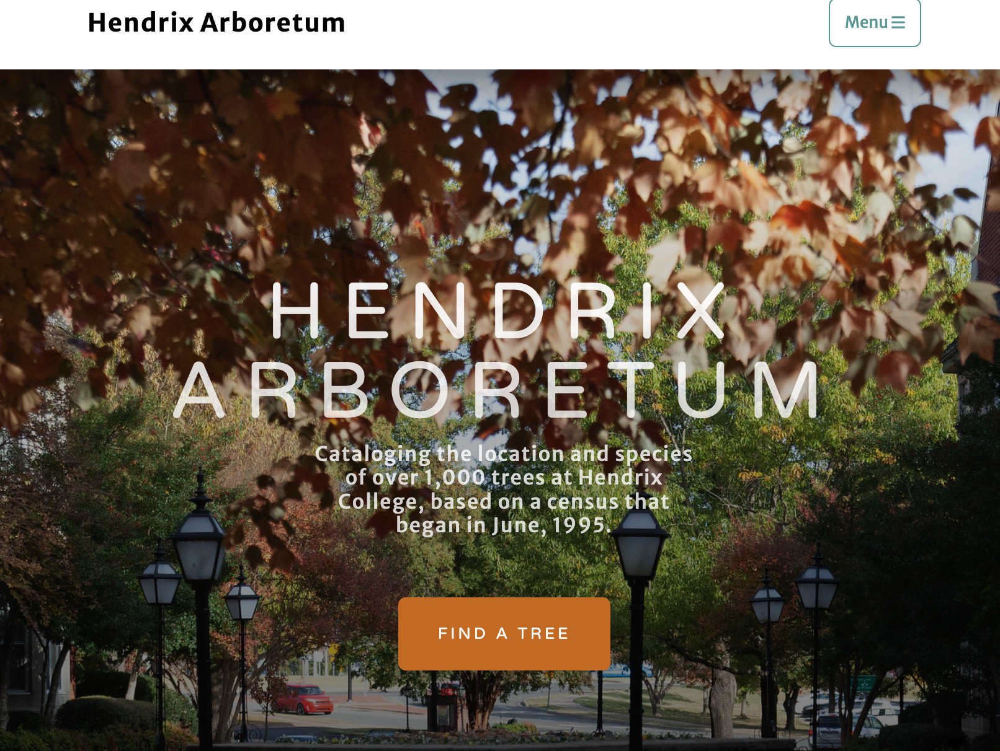

[The Hendrix Arboretum](https://arboretum.hendrix.edu/).

This project is my first web design project for a client. I worked in a group of four other students with our client, Holly Payne of Porch Swings Farms. Holly Payne does deliveries of eggs and pork products on a weekly basis. She needed a way to track when clients were to get deliveries, how much product to make every week, what each client's bill would be, and what order to deliver products in. 

We decided to design a website where our client was the only user. Our client didn't have database experience but used Excel. The website would take in a .CSV file of clients, addresses, delivery times, products requested, and contact information. The site would use that data to pobulate a database with customers as the key, with contact, address, as well as tables for orders and deliveries. The would be searchable through the GUI, and would return what deliveries where due. Additionally, it would use MapQuest API to make the best route given the deliveries needed. 

The project greatly helped build my trouble shooting skills. Working with ASP.NET and Azure for the first time, the program frequently crashed and we were encouraged to solve these problems within our team. I learned how to comb through the docs and stackoverflow.com to find siilar issues and extrapolate what I was learning into new situations. Additionally, I felt that my communication skills helped our team, both in coordination with our client through solving problems efficiently within the group. 

Our client ran an organic farm that served a local clientele of individual families. These types of systems boost food sovereignty, giving the community more control over where their food comes from. I actually started working on my client's farm as a part of this project! Working with raddishes, chickens, and pigs every Friday was an incredible way to end each work week, and left me refreshed going into the weekend. It also allows me to put ideas I have about sustainability into practice. 